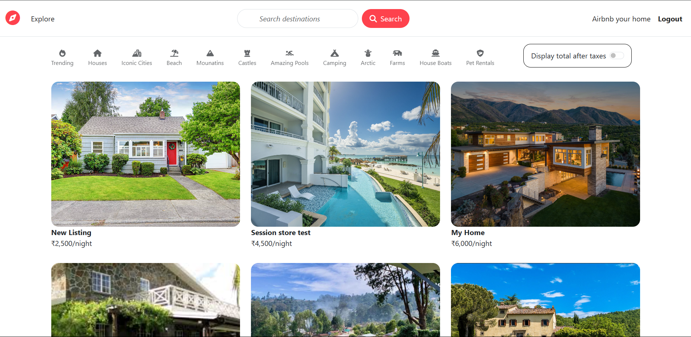

# 🏡 Airbnb-Inspired Clone

A full-stack web application inspired by Airbnb, built using Express, MongoDB, and EJS. Users can browse listings, post rentals, and explore map-based locations with dynamic routing and flash messaging.

---

## 🌐 Live Demo

[Visit Site](https://airbnb-inspired-clone.onrender.com/)

---

## 📷 Preview

---

## 🛠️ Tech Stack

- **Backend**: Node.js, Express.js
- **Database**: MongoDB Atlas
- **Frontend**: HTML, CSS, JavaScript, EJS Templates
- **Geocoding**: OpenStreetMap (Nominatim)
- **Hosting**: Render
- **Version Control**: Git & GitHub

---

## 🚀 Features

- ✅ Create, read, update, and delete property listings
- 📍 Real-time geolocation with GeoJSON
- 🔒 Secure login & session handling
- 🎉 Flash messages for success/error feedback
- 🧭 Dynamic routing and templating with EJS
- 🗂️ Git-tracked with secure `.env` management

